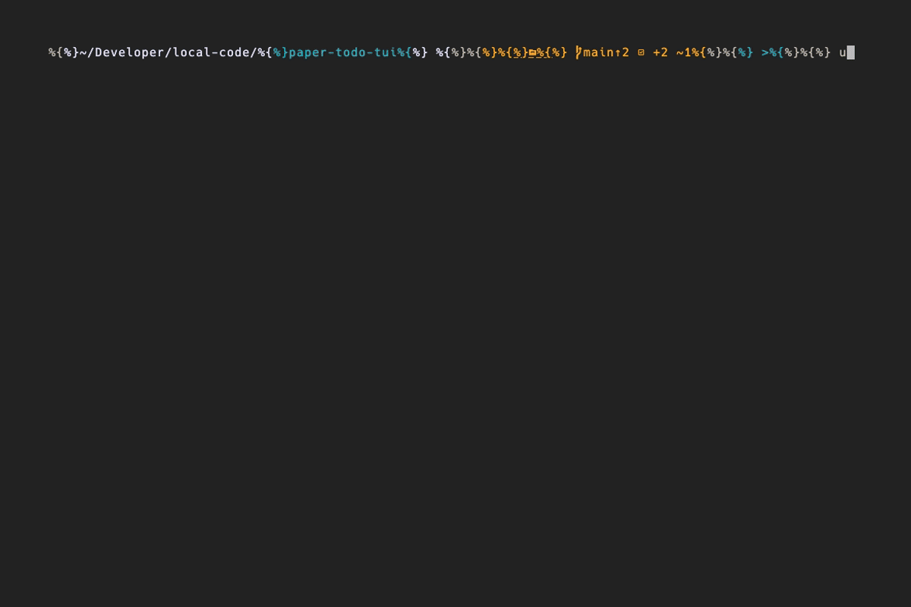

# Paper TODO TUI



Dice-based TODO application inspired by [Paper Apps TODO](https://gladdendesign.com/products/paper-apps-todo)

## Features

- Roll dice to randomly select one of six tasks to work on
- Roll dice to determine work duration (1-5 = 10x minutes, 6 = 10-minute break)
- Countdown timer that persists across sessions
- All state saved automatically to `~/.local/share/paper-todo/state.json` (or XDG Base Directory compliant)

## Installation

```bash
# Install dependencies
uv sync

# Run the app
uv run paper-todo
```

## Development

```bash
uv run pytest -v

# Run tests with coverage
uv run pytest -v --cov=paper_todo --cov-report=term-missing
```

## Usage

### Workflow

1. Add your tasks using keys 1-6
2. Press **T** to roll for time duration:
   - Roll 1-5: Work for (roll × 10) minutes on a random task
   - Roll 6: Take a 10-minute break
3. Press **Space** to start the timer
4. Press **C** to mark the current task complete when done or **E** to end early
5. Repeat!

## How It Works

Adapted from the sold out <https://gladdendesign.com/products/paper-apps-todo>, the dice-based approach adds an element of randomness and fun to task management:

- Rolling for time creates variety in your work sessions
- Rolling for tasks helps you avoid decision paralysis
- The 10-minute break on rolling a 6 ensures regular breaks
- Timer persistence means you can quit and resume anytime
